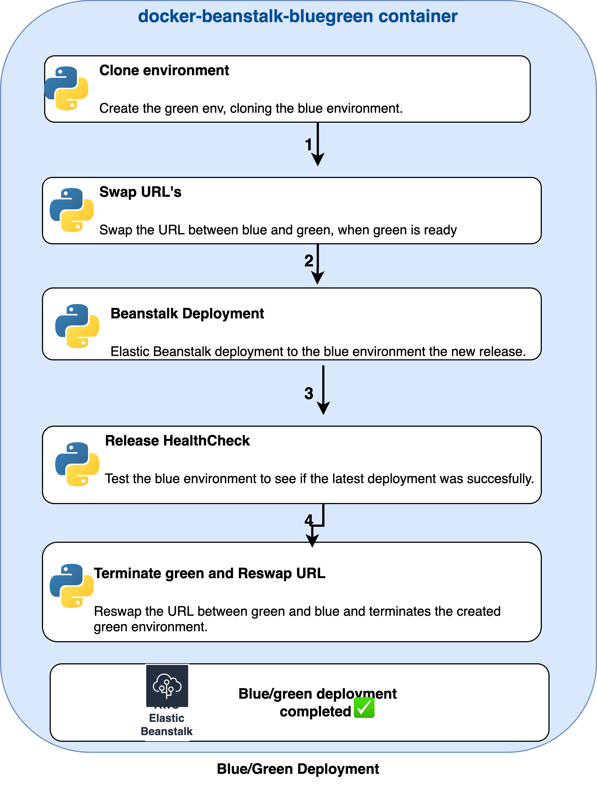

# docker-beanstalk-bluegreen

This module implements a docker image, that applies the blue-green deployment strategy using python scripts.


## Blue Green Deployment Strategy

### About 
From a disaster recovery and development perspective, when an application is developed and deployed to an Elastic Beanstalk environment, having two separate, but identical, environments *blue and green* helps increase availability and reduce risk.

In this case, the blue environment is the production environment that normally handles live traffic. 

The container based on this image, creates a clone (green) of the live Elastic Beanstalk environment (blue),     then swaps the URLs between the two environments. While the container deploys application code to the original environment and testing and maintenance take place the temporary clone environment handles the live traffic.

Suppose deployment to the blue environment fails because of issues with the application code. While the code is being corrected and recommitted to the repository, the green environment serves the live traffic, and there is no downtime.
Once deployment to the blue environment is successful, and code review and code testing are completed, the pipeline once again swaps the URLs between the green and blue environments.

 The blue environment starts serving the live traffic again, and the container terminates the temporarily created green environment. Not having to continuously run parallel environments, saving costs.

### Execution Diagram of `docker-beanstalk-bluegreen`


All the steps are done using python:
1. The first stage clones the blue environment, which results in a green environment.
2. The second stage swaps the URLs between the blue and the green environments. Once this is complete, the green environment serves the live traffic.
3. The third stage performs the deployment of the new changes to the blue environment.
4. If the deployment is successful, the fourth stage triggers a test on the blue environment to see if it can access a 200 OK in the response. If the response is other than 200 OK, the pipeline doesn’t proceed, and marks this stage as failed.
5. If the test stage is successful, the fifth stage again swaps the URLs between the blue and green environments and then terminates the green environment. The blue environment gets back its initial Elastic Beanstalk CNAME that it initially had for serving the live traffic.

## Usage

---

### Requirement: Environment variables
```shell
AWS_ACCESS_KEY_ID
AWS_SESSION_TOKEN
AWS_SECRET_ACCESS_KEY
AWS_DEFAULT_REGION

ENV
BLUE_ENV_NAME
GREEN_ENV_NAME
BEANSTALK_APP_NAME
CREATE_CONFIG_TEMPLATE_NAME
BLUE_CNAME_CONFIG_FILE
ARTIFACTS_S3_BUCKET

```

### Build Locally
```bash
# build image locally
$ make build
```

## Author

Managed by [DNX Solutions](https://github.com/DNXLabs).

## License

Apache 2 Licensed. See [LICENSE](https://github.com/DNXLabs/docker-beanstalk-bluegreen/blob/master/LICENSE) for full details.